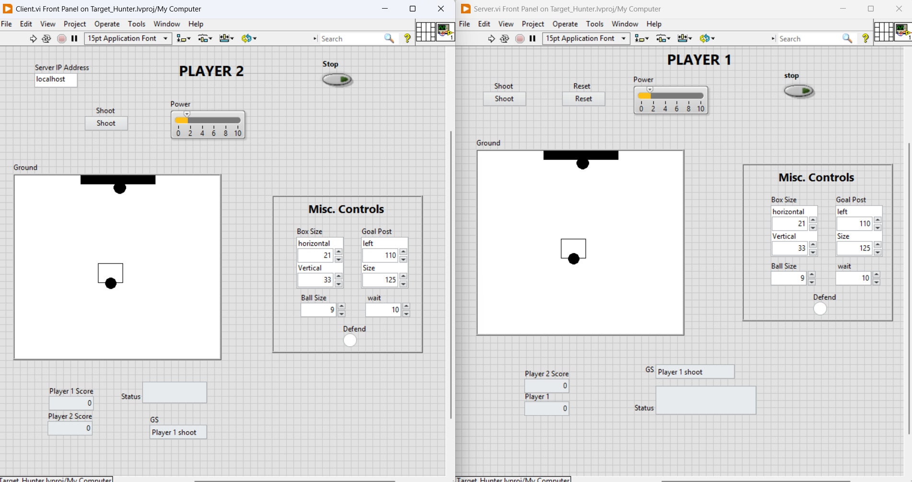

# TCP Penalty Shootout Game (LabVIEW)

A two-player penalty shootout game built in LabVIEW, played over a TCP/IP
network connection. One PC runs the Server (Player 1) and the other runs the
Client (Player 2), and the two play a best-of-5 penalty shootout in real time.
I built this to explore client-server networking and real-time data exchange
in LabVIEW.

## How it works
The game uses a client-server architecture over TCP/IP. The Server VI hosts the
match and the Client VI connects to it. Player actions (shoot, power, defend)
and game state (scores, status, ball position) are exchanged over the TCP
connection so both screens stay in sync. Each player takes turns shooting and
defending across 5 penalties, and the higher score wins.

## How to run
1. On the host PC, run **Server.vi** (this is Player 1).
2. On the second PC, run **Client.vi** (this is Player 2).
3. **Connecting across two different PCs:** in the Client's "Server IP Address"
   field, enter the **IP address of the PC running the Server** (not localhost).
4. **Playing on a single PC (testing):** leave the Server IP Address as
   **localhost** to run both VIs on the same machine.
5. Make sure both PCs are on the same network and that the TCP port is allowed
   through any firewall.

## Features
- Real-time two-player gameplay over TCP/IP
- Separate Server (Player 1) and Client (Player 2) front panels
- Best-of-5 penalty shootout with live score tracking
- Adjustable shot power and configurable game settings (box size, goal post,
  ball size, timing)
- Shoot and defend mechanics with game status feedback

## Screenshots

**Player 1 (Server) and Player 2 (Client) front panels**

## Built with
- LabVIEW 2021 (21.0)
- TCP/IP communication functions

## Skills demonstrated
LabVIEW, TCP/IP Networking, Client-Server Architecture, Real-Time Data Exchange, GUI Design
